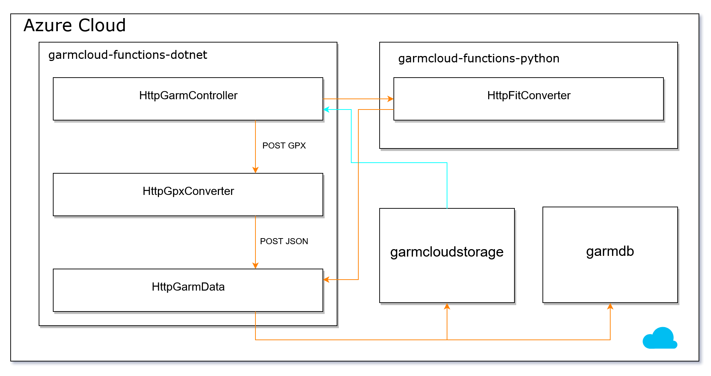

# GarmCloud


## Description

A student project for working with cloud architectures at Technical University of Applied Sciences Rosenheim.

Web service with Azure Functions to convert GPX data files and Garmin own file format FIT to JSON files. The data gets processed and the fitness data gets stored or returned.

My [Garmin Forerunner 210](https://buy.garmin.com/de-DE/DE/p/83280) tracks data, like heartbeats, GPS coordinates, altitude and saves this in a track collection as Garmin FIT file on its internal storage. Third party software is needed to read the FIT formatted file. GPX is an already open standard but is hard to process and not as common as JSON nowardays.

I wanted to test, if I can read these formats and convert them into JSON. A nice side effect is that I get in touch with Cloud Architecture, Functions and storage as well.


## Minimal viable Product (MVP)

**Features:**
* Upload of files (GPX und FIT) via Restful API: POST and GET
* Processing FIT files and converting to an open format (JSON)
* Processing GPX files and converting to an open format (JSON)
* Store the track data in a DB with open access via UUID
* Store the track data files in a cloud storage with open access via UUID
* Deployment as Azure components:
    * Azure Functions (Python and C# dotnet)
    * Azure SQL DB
    * Azure Blob Storage


## Architecture

### logical architecture


### Distribution architecture



### technical architecture


### estimation of costs


[Pricing Calculator Azure](https://azure.microsoft.com/de-de/pricing/calculator/)  


## Components

### garmcloud-functions-dotnet
garmcloud-functions-dotnet as Azure App Service for dotnet C# functions.

#### HttpGarmController
The HttpGarmController processes POST and GET requests and calls the fitting converter function for the given file type.
* GPX file: HttpGpxConverter 
* FIT file: HttpFITConverter

The caller gets the UUID as identifier after a POST and can now receive the JSON file with using this UUID with the GET request.


## CI/CD (originally GitLab)

The CI/CD Script uses:

* MS dotnet Docker image [mcr.microsoft.com/dotnet/core/sdk:3.1](https://hub.docker.com/_/microsoft-dotnet-core-sdk/) 
* [Azure CLI Tools](https://docs.microsoft.com/de-de/cli/azure/install-azure-cli-linux?view=azure-cli-latest)
* [Azure Functions Core Tools](https://docs.microsoft.com/de-de/azure/azure-functions/functions-run-local?tabs=linux%2Ccsharp%2Cbash)


### GitLab CI/CD script

**.gitlab-ci.yml**
```yaml
stages:
  - deploy_dotnet
  - deploy_python

deploy_dotnet:
  stage: deploy_dotnet
  image: mcr.microsoft.com/dotnet/core/sdk:3.1
  only:
    - master
  script:
    # azure cli tools
    - curl -sL https://aka.ms/InstallAzureCLIDeb | bash
    # azure function core tools
    - curl https://packages.microsoft.com/keys/microsoft.asc | gpg --dearmor > microsoft.gpg
    - mv microsoft.gpg /etc/apt/trusted.gpg.d/microsoft.gpg
    - sh -c 'echo "deb [arch=amd64] https://packages.microsoft.com/repos/microsoft-ubuntu-buster-prod buster main" > /etc/apt/sources.list.d/dotnetdev.list'
    - sh -c 'echo "deb [arch=amd64] https://packages.microsoft.com/debian/10/prod buster main" > /etc/apt/sources.list.d/dotnetdev.list'
    - apt-get update && apt-get install azure-functions-core-tools

    # azure login and deploy
    - cd garmcloud-functions-dotnet/
    - az login --service-principal -u $AZ_SERVICE_PRINCIPAL_URL -p $AZ_SERVICE_PRINCIPAL_SECRET --tenant $AZ_SERVICE_PRINCIPAL_TENANT
    - func azure functionapp publish garmcloud-functions-dotnet
    # azure force set remote settings
    - az functionapp config appsettings set --name garmcloud-functions-dotnet --resource-group sINFdahall-garmcloud --settings HttpGpxConverterUrl=https://garmcloud-functions-dotnet.azurewebsites.net/api/HttpGpxConverter
    - az functionapp config appsettings set --name garmcloud-functions-dotnet --resource-group sINFdahall-garmcloud --settings HttpFitConverterUrl=https://garmcloud-functions-python.azurewebsites.net/api/HttpFitConverter
    - az functionapp config appsettings set --name garmcloud-functions-dotnet --resource-group sINFdahall-garmcloud --settings HttpGarmDataUrl=https://garmcloud-functions-dotnet.azurewebsites.net/api/HttpGarmData


deploy_python:
  stage: deploy_python
  image: mcr.microsoft.com/dotnet/core/sdk:3.1
  only:
    - master
  script:
    # azure cli tools
    - curl -sL https://aka.ms/InstallAzureCLIDeb | bash
    # azure function core tools
    - curl https://packages.microsoft.com/keys/microsoft.asc | gpg --dearmor > microsoft.gpg
    - mv microsoft.gpg /etc/apt/trusted.gpg.d/microsoft.gpg
    - sh -c 'echo "deb [arch=amd64] https://packages.microsoft.com/repos/microsoft-ubuntu-buster-prod buster main" > /etc/apt/sources.list.d/dotnetdev.list'
    - sh -c 'echo "deb [arch=amd64] https://packages.microsoft.com/debian/10/prod buster main" > /etc/apt/sources.list.d/dotnetdev.list'
    - apt-get update && apt-get install azure-functions-core-tools

    # azure login and deploy
    - cd garmcloud-functions-python/
    - az login --service-principal -u $AZ_SERVICE_PRINCIPAL_URL -p $AZ_SERVICE_PRINCIPAL_SECRET --tenant $AZ_SERVICE_PRINCIPAL_TENANT
    - func azure functionapp publish garmcloud-functions-python
    # azure force set remote settings
    - az functionapp config appsettings set --name garmcloud-functions-python --resource-group sINFdahall-garmcloud --settings HttpGarmDataUrl=https://garmcloud-functions-dotnet.azurewebsites.net/api/HttpGarmData 

```


## Sideproject for feasibility checks

### fit2json
This is based on [fitdecode](https://github.com/polyvertex/fitdecode) from Jean-Charles Lefebvre. It converts FIT files to JSON.

### gpx2json
Converts GPX files to JSON.

## Built with

* [fitdecode](https://github.com/polyvertex/fitdecode) - Python FIT Lib from Jean-Charles Lefebvre
* [newtonsoft JSON](https://www.newtonsoft.com/json) 
* [sqlkata](https://sqlkata.com/) 
* [Azure Functions](https://azure.microsoft.com/de-de/services/functions/) - Azure serverless Functions
* [Azure SQL Database](https://azure.microsoft.com/de-de/services/sql-database/) - Azure SQL Database
* [Azure Blob Storage](https://azure.microsoft.com/de-de/services/storage/blobs/) - Azure Blob Storage
* [MS dotnet core Docker Image](https://hub.docker.com/_/microsoft-dotnet-core-sdk/) - Docker Image with dotnet core
* [MS dotnet core tools](https://docs.microsoft.com/de-de/dotnet/core/tools/dotnet-install-script) - MS dotnet core tools
* [Azure CLI Tools](https://docs.microsoft.com/de-de/cli/azure/install-azure-cli-linux?view=azure-cli-latest) - Azure tools 


# Devices

  
[Garmin Forerunner 210](https://buy.garmin.com/de-DE/DE/p/83280)

# Author

[David T. Halletz](https://github.com/Tristus-DH) - **David T. Halletz**


# Demo


